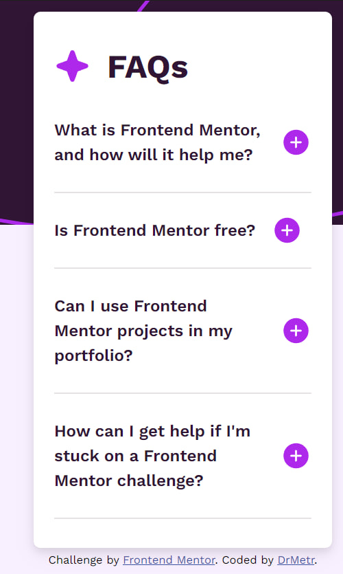

# Frontend Mentor - FAQ accordion solution

This is a solution to the [FAQ accordion challenge on Frontend Mentor](https://www.frontendmentor.io/challenges/faq-accordion-wyfFdeBwBz). Frontend Mentor challenges help you improve your coding skills by building realistic projects. 

## Table of contents

- [Overview](#overview)
  - [The challenge](#the-challenge)
  - [Screenshot](#screenshot)
  - [Links](#links)
- [My process](#my-process)
  - [Built with](#built-with)
  - [What I learned](#what-i-learned)
  - [Continued development](#continued-development)
  - [Useful resources](#useful-resources)
- [Author](#author)

## Overview

### The challenge

Users should be able to:

- Hide/Show the answer to a question when the question is clicked
- Navigate the questions and hide/show answers using keyboard navigation alone
- View the optimal layout for the interface depending on their device's screen size
- See hover and focus states for all interactive elements on the page

### Screenshot
1. Desktop active version (from VS Code preview)

2. Mobile inactive version (from VS Code preview)

### Links

- Solution URL: [Add solution URL here](https://your-solution-url.com)
- Live Site URL: [https://drmetr.github.io/FAQ-Accordion-challenge/](https://drmetr.github.io/FAQ-Accordion-challenge/)

## My process

  First, I've decided to break the original text given in the starter index.html file with a js script instead of putting html tags around each sentence manually. The process of making such js code took me a week while putting tags would only take several minutes though. I've encountered troubles breaking the text with my regex: the last question-answer pair wouldn't appear in the final object of Qs as keys and As as answers. I tried multiple other regex which wouldn't work. Then I figured there's an extra space in the original text that broke the regex rule. I removed it and it worked perfectly. Later I learned about Intl.Segmenter but decided not to include it here since I was already past that stage.

  Then I spent several days trying to figure the cycle that would create divs with questions and anwers hidden. It took so long because I couldn't understand why it keeps only adding the "show/hide" to the very first question and triggering on every question showing the very first answer instead of showing the corresponding one. In the end it turned out that I should have replace the word "document" with "question" because the code used to scan the whole document searching for the "answer" with querySelector when it should scan only the clicked question div.

  The last trouble I met is was the images. The VS Code preview acknowledged the existence of images added within css or js files but the browser wouldn not. It had no problem with images attached in the index.html but urls from style.css or script.js were ignored. It turned out to be wrong file paths that I didn't know were wrong.

### Built with

- Semantic HTML5 markup
- CSS custom properties
- Flexbox
- Mobile-first workflow
- Sass
- Vanilla JavaScript

### What I learned

I learned about file paths, applied my fresh JS and DOM knowledges, revised Sass and CSS. 

### Continued development

I recognise that my code looks childish and rambling but it works for now. I plan to continue understanding pure JS and Sass, also I'll make sure to unerstand git better.

### Useful resources

- [File paths reminder](https://css-tricks.com/quick-reminder-about-file-paths/) - This helped me a great deal understanding file paths and why my browser wouldn't recognize my images in script.js and style.css.
- [How to split JavaScript strings into sentences, words or graphemes with "Intl.Segmenter"](https://www.stefanjudis.com/today-i-learned/how-to-split-javascript-strings-with-intl-segmenter/) - self-describing.
- [Eloquent JavaScript Code Sandbox](https://eloquentjavascript.net/code/) - I hate the book but I liked the minimalistic code sandbox and since console.log command doesn't work properly in VS Code I used it to test my script with console.log commands.

## Author

- Website - [Add your name here](https://www.your-site.com)
- Frontend Mentor - [@yourusername](https://www.frontendmentor.io/profile/yourusername)
